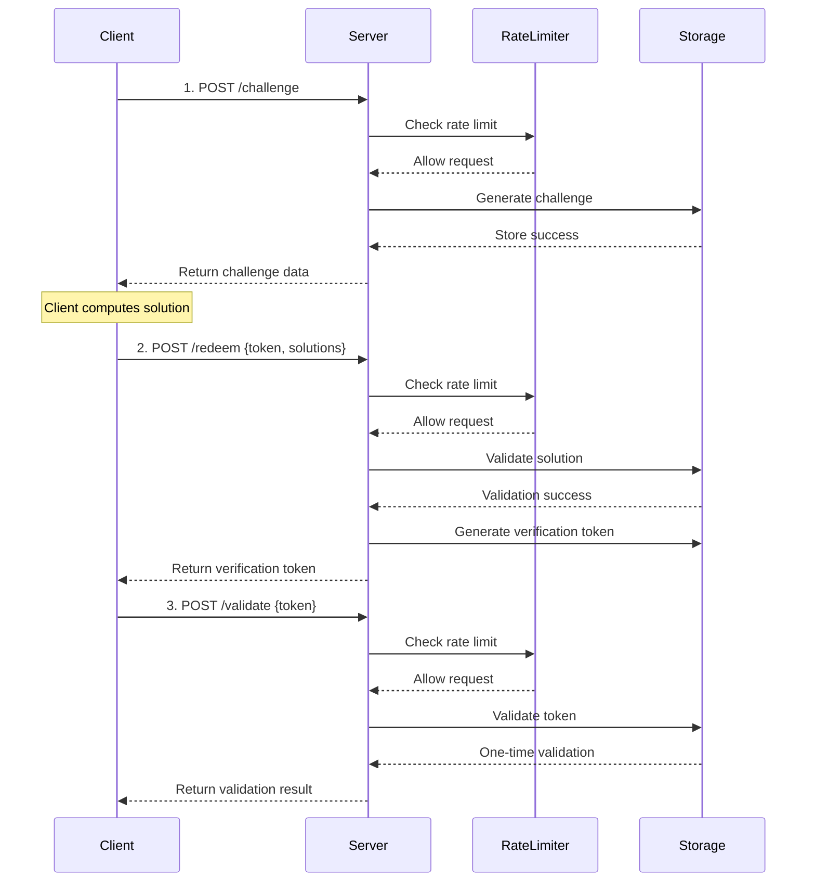

# Capito Cap PHP Server for cap.js captcha
<h2 align="center">
  
  <br>
  CAPITO
  <br>
<i>cap.js captcha php server</i>
</h2>


A lightweight, high-performance open-source security validation library that distinguishes human users from bots via compute-intensive tasks, providing a secure, interaction-free validation method. 

Compatible with 🧢[CapJs](https://capjs.js.org/) Widget [github](https://github.com/tiagozip/cap). Tested with widget 0.1.28+ 
If you're using react, have a look to this widget : [takeshape/use-cap](https://github.com/takeshape/use-cap)

[](https://php.net)
[](https://opensource.org/licenses/Apache-2.0)

## ✨ Core Features

### Architecture
- **SHA-256 Proof-of-Work**: Cryptographically secure validation mechanism
- **Modular Storage**: Supports memory, file, and Redis storage backends
- **Rolling Penalty Rate Limiting**: Brute force protection with escalating penalties
- **Auto Cleanup**: Intelligent expiry and memory-friendly data cleaning

### Production 
- **Can be deployed without composer**: for low cost php servers - just copy files and play !
- **Large possibility of storage**: data can be store on a file, or on MySql, sqLite or Redis (and 5 minutes job to adapt to other DB)
- **Zero Core Dependencies**: Requires only PHP >= 7.4 and JSON extension
- **Full Testing**: Unit and integration test coverage
- **Deployment Guide**: Detailed Nginx production configuration
- **Frontend Integration**: Perfectly compatible with cap.js frontend library

### Security
- **Replay Attack Prevention**: One-time validation tokens
- **Typed Exceptions**: Comprehensive error handling and categorization
- **Brute Force Protection**: Per-IP rolling penalty rate limiting, compatible with proxy

### Developer 
- **PSR-4 Standard**: Modern PHP autoloading compliance
- **Unified Interfaces**: Pluggable storage interface design
- **international English**: sorry, even I should, I don't speak chinese yet


### Why we create a new repo/server and not just update Sparkinzy one ?
As of sept 2025, we needed a full functional PHP Server. Sparkinzy Cap is mostly in Chinese, but this was not the issue : Sparkinzy is supposed to offer 3 storage classes (redis, file, memory), but only redis seems to works correctly (the default memoryStorage can't run in PHP as PHP is stateless, and the fileStorage is buggy). Sparkinzy is also assuring compatibility with go-cap, and several legacy systems.

We needed urgently a clean, modern, fast, easy to maintain server, adapted to last version of cap.js, able to store data easily on files or DB (derivating a new storage class is very easy, even for an AI). Call to storage classes and storage optimized to limit overhead. Main functions of main class Cap has also been reworked to be fully compatible with storage, remove all legacy stuff and clean some points (for example make RateLimiter compatible with proxy). 

And a robust functional server (`captcha.php`) is provided. You just need to modify the configuration of it (storage type, and challenge config if needed) before copying to your server. 
...all in english : the translated doc include all the most important things, in one concise file.

Using git History, as we imported Sparkinzy to create this repo (initial branch), you'll be able to see exactly what has been done: In case of questions, don't hesitate to delve also into Sparkinzy. You'll find for example nginx informations. Again, thanks a lot to him for his project and his time 🥰.

## 📦 Configuration 
Configuration is typicaly set in captcha.php
### FileStorage configuration

```php
<?php
require_once __DIR__ . '/src/Cap.php';
require_once __DIR__ . '/src/Interfaces/StorageInterface.php';
require_once __DIR__ . '/src/Storage/FileStorage.php';
require_once __DIR__ . '/src/RateLimiter.php';
require_once __DIR__ . '/src/Exceptions/CapException.php';

use Capito\CapPhpServer\Cap;
use Capito\CapPhpServer\Storage\FileStorage;
use Capito\CapPhpServer\Exceptions\CapException;

$capServer = new Cap([
    // High-performance configuration (optimized for 90%+ improvement)
    'challengeCount' => 3,          // 3 challenges (1–3 seconds to solve)   [== 5 higher sec]
    'challengeSize' => 16,          // 16-byte salt    
    'challengeDifficulty' => 2,     // Difficulty 2 (balanced optimization)  [==3 hard]
    'bruteForceLimit' => 5,         // 5 requests per window                  [==3 stricter limit]
    'bruteForceWindow' => 60,       // 60 second time window                  [==30 shorter window]
    'bruteForcePenalty' => 60,      // 60 second penalty when blocked         [==120 longer penalty]
    'tokenVerifyOnce' => true,      // One-time validation
    'challengeExpires' => 300,      // Expires in 5 minutes
    'tokenExpires' => 600,          // Token expires in 10 minutes  
    'storage' => new FileStorage(['path' => __DIR__ . '/../.data/cap_data.json'])
]);
$cap = new Cap($advancedConfig);
```

### sqLiteStorage configuration

```php
<?php
require_once __DIR__ . '/src/Cap.php';
require_once __DIR__ . '/src/Interfaces/StorageInterface.php';
require_once __DIR__ . '/src/Storage/SqliteStorage.php';
require_once __DIR__ . '/src/RateLimiter.php';
require_once __DIR__ . '/src/Exceptions/CapException.php';

use Capito\CapPhpServer\Cap;
use Capito\CapPhpServer\Storage\SqLiteStorage;
use Capito\CapPhpServer\Exceptions\CapException;

$capServer = new Cap([
    // High-performance configuration (optimized for 90%+ improvement)
    'challengeCount' => 3,          // 3 challenges (1–3 seconds to solve)   [== 5 higher sec]
    'challengeSize' => 16,          // 16-byte salt    
    'challengeDifficulty' => 2,     // Difficulty 2 (balanced optimization)  [==3 hard]
    'bruteForceLimit' => 5,         // 5 requests per window                  [==3 stricter limit]
    'bruteForceWindow' => 60,       // 60 second time window                  [==30 shorter window]
    'bruteForcePenalty' => 60,      // 60 second penalty when blocked         [==120 longer penalty]
    'tokenVerifyOnce' => true,      // One-time validation
    'challengeExpires' => 300,      // Expires in 5 minutes
    'tokenExpires' => 600,          // Token expires in 10 minutes  
    'storage' => new SqliteStorage(['path' => __DIR__ . '/../.data/cap_data.sqlite'])
]);
$cap = new Cap($advancedConfig);
```

### MySql configuration

```php
require_once __DIR__ . '/src/Cap.php';
require_once __DIR__ . '/src/Interfaces/StorageInterface.php';
require_once __DIR__ . '/src/Storage/MysqlStorage.php';
require_once __DIR__ . '/src/RateLimiter.php';
require_once __DIR__ . '/src/Exceptions/CapException.php';

use Capito\CapPhpServer\Cap;
use Capito\CapPhpServer\Storage\MysqlStorage;
use Capito\CapPhpServer\Exceptions\CapException;

$capServer = new Cap([
    'challengeCount' => 3,          // 3 challenges (1–3 seconds to solve)   [== 5 higher sec]
    'challengeSize' => 16,          // 16-byte salt    
    'challengeDifficulty' => 2,     // Difficulty 2 (balanced optimization)  [==3 hard]
    'bruteForceLimit' => 5,         // 5 requests per window                  [==3 stricter limit]
    'bruteForceWindow' => 60,       // 60 second time window                  [==30 shorter window]
    'bruteForcePenalty' => 60,      // 60 second penalty when blocked         [==120 longer penalty]
    'tokenVerifyOnce' => true,      // One-time validation
    'challengeExpires' => 300,      // Expires in 5 minutes
    'tokenExpires' => 600,          // Token expires in 10 minutes  
    'storage' => new MysqlStorage([
        'host'     => 'localhost',
        'dbname'   => 'your_database_name',
        'username' => 'your_username',
        'password' => 'your_password',
        // Optional: table name, defaults to 'cap_tokens'
        'table'    => 'cap_tokens'
    ])
]);
```

### More "challenging/secure" configuration
```
    'challengeCount' => 5,          // higher sec
    'challengeSize' => 16,          
    'challengeDifficulty' => 3,     // Difficulty 3 (hard)
    'bruteForceLimit' => 3,         // only 3 requests per window, stricter limit
    'bruteForceWindow' => 120,      // 2 minute window, longer wait time
    'bruteForcePenalty' => 300,     // 5 minute penalty when blocked, much longer penalty
```

## ⚙️ Complete Configuration Reference

The Cap class supports comprehensive configuration options to fine-tune security, performance, and behavior.

### Basic Challenge Configuration

| Parameter | Type | Default | Description |
|-----------|------|---------|-------------|
| `challengeCount` | `int` | `3` | Number of proof-of-work challenges to generate |
| `challengeSize` | `int` | `16` | Size of challenge salt in hexadecimal characters |
| `challengeDifficulty` | `int` | `2` | Base difficulty level (higher = more computation required) |
| `challengeExpires` | `int` | `600` | Challenge expiration time in seconds (10 minutes) |

### Token Configuration

| Parameter | Type | Default | Description |
|-----------|------|---------|-------------|
| `tokenExpires` | `int` | `1200` | Verification token expiration time in seconds (20 minutes) |
| `tokenVerifyOnce` | `bool` | `true` | Whether tokens can only be validated once |

### Brute Force Protection (Rolling Penalty Rate Limiting)

| Parameter | Type | Default | Description |
|-----------|------|---------|-------------|
| `bruteForceLimit` | `int` | `5` | Maximum challenge requests allowed in the initial time window |
| `bruteForceWindow` | `int` | `60` | Initial time window in seconds for counting requests (e.g., 5 requests per 60 seconds) |
| `bruteForcePenalty` | `int` | `60` | Penalty duration in seconds when limit exceeded. Set to 0 to disable brute force protection |

**Rolling Penalty Behavior**: When you exceed the limit (5 requests in 60 seconds), you must wait the penalty duration FROM when you made the blocked request. Each blocked request resets the penalty timer. 
- Extending behavior - each request extends the window
- Reset condition - only after full inactivity period
- Penalty system - violations cause temporary blocks

### Dynamic Difficulty Scaling

| Parameter | Type | Default | Description |
|-----------|------|---------|-------------|
| `dynamicDifficultyEnabled` | `bool` | `true` | Enable automatic difficulty adjustment based on usage patterns |
| `difficultyModerate` | `int` | `3` | Difficulty level when moderate rate limiting pressure detected |
| `difficultyAggressive` | `int` | `4` | Difficulty level when high rate limiting pressure detected |

**Rate Limiting Thresholds (Progressive Escalation):**
- **Normal**: Uses base `challengeDifficulty` when few tokens consumed 
  - *Example: With default bruteForceLimit of 5, when ≤ 1rd and 2nd token used*
- **Moderate**: Uses `difficultyModerate` when moderate usage (> 40% of limit used)
  - *Example: With default limit of 5, triggers when 3rd and 4th tokens used*  
- **Aggressive**: Uses `difficultyAggressive` when heavy usage (> 80% of limit used)
  - *Example: With default limit of 5, triggers when the 5th token is used*

**First Challenge Behavior:**
- **First request from new identifier**: Always uses `challengeDifficulty` (starts with full token bucket)
- **Subsequent requests**: Dynamic difficulty kicks in as rate limit tokens are consumed
- *Example: With default settings, first 2 challenges use base difficulty, then scaling begins*

**Threshold Calculation:**
- Moderate pressure threshold when usedtoken > 0.4 x limit (ie for limit=5, when 3rd and 4rd use)
- High pressure threshold when usedtoken > 0.8 x limit (ie for limit=5, when 5rd use)
- Thresholds automatically scale with your `bruteForceLimit` setting.


### Storage Configuration

| Parameter | Type | Default | Description |
|-----------|------|---------|-------------|
| `storage` | `StorageInterface` | **Required** | Storage backend implementation (FileStorage, MysqlStorage, etc.) |

### Configuration Examples

#### Performance-Optimized (Fast User Experience)
```php
#### Performance-Focused (Faster Validation)
```php
$config = [
    'challengeCount' => 2,           // Fewer challenges
    'challengeDifficulty' => 1,      // Lower base difficulty  
    'bruteForceLimit' => 8,          // Higher brute force threshold
    'bruteForceWindow' => 30,        // Shorter time window
    'bruteForcePenalty' => 30,       // Shorter penalty duration
    'difficultyModerate' => 2,       // Gentler difficulty scaling
    'difficultyAggressive' => 3,
    'storage' => new FileStorage(['path' => '/tmp/cap_fast.json'])
];
```

#### Security-Focused (Maximum Protection)
```php
$config = [
    'challengeCount' => 5,           // More challenges
    'challengeDifficulty' => 3,      // Higher base difficulty
    'bruteForceLimit' => 3,          // Very low brute force threshold
    'bruteForceWindow' => 120,       // 2 minute time window
    'bruteForcePenalty' => 300,      // 5 minute penalty duration
    'difficultyModerate' => 5,       // Aggressive difficulty scaling
    'difficultyAggressive' => 7,
    'storage' => new MysqlStorage([...])
];
```
```

#### Security-Focused (Maximum Protection)
```php
$config = [
    'challengeCount' => 5,           // More challenges
    'challengeDifficulty' => 3,      // Higher base difficulty
    'rateLimitRps' => 3,             // Strict rate limiting
    'rateLimitBurst' => 10,          // Small burst allowance
    'bruteForceLimit' => 5,          // Low brute force threshold
    'bruteForceWindow' => 120,       // Longer protection window
    'difficultyModerate' => 5,       // Aggressive difficulty scaling
    'difficultyAggressive' => 7,
    'storage' => new MysqlStorage([...])
];
```

#### Disabled Features (Minimal Setup)
```php
$config = [
    'bruteForcePenalty' => 0,             // Disable brute force protection (set penalty to 0)
    'dynamicDifficultyEnabled' => false,  // Disable difficulty scaling
    'storage' => new FileStorage(['path' => '/tmp/cap_simple.json'])
];
```

## 🔦 Installation
### Composer Installation

```bash
composer require Capito/cap_php_server
```

### Manual Installation

1. Download and extract the source code
2. Include the `src/` directory in your project
3. Manually require needed files

```php
require_once __DIR__ . '/src/Cap.php';
require_once __DIR__ . '/src/Interfaces/StorageInterface.php';
require_once __DIR__ . '/src/Storage/MemoryStorage.php';
// ...other required files
```

## 🎨 Frontend Integration

### cap.js Automated Integration

```html
<!DOCTYPE html>
<html>
<head>
    <script src="https://cdn.jsdelivr.net/npm/@cap.js/widget@0.1.26/cap.min.js"></script>
</head>
<body>
    <!-- Cap.js component -->
    <cap-widget id="cap" data-cap-api-endpoint=""></cap-widget>
    
    <script>
        const widget = document.querySelector("#cap");
        
        // cap.js automated workflow
        widget.addEventListener("solve", function (e) {
            console.log('✅ Challenge automatically completed');
            console.log('Verification token:', e.detail.token);
            
            // Note: Before firing the solve event, cap.js 0.1.26 has already:
            // 1. Fetched challenge (/challenge)
            // 2. Solved challenge (client computation)
            // 3. Submitted solution (/redeem)
            // 4. Received verification token
            
            const verificationToken = e.detail.token;
            
            // Optional: Validate token
            fetch('/validate', {
                method: 'POST',
                headers: {
                    'Content-Type': 'application/json',
                },
                body: JSON.stringify({
                    token: verificationToken
                })
            })
            .then(response => response.json())
            .then(data => {
                if (data.success) {
                    console.log('✅ Token is valid!');
                    // Allow form submission or next step
                    enableFormSubmission();
                } else {
                    console.error('❌ Invalid token!');
                }
            });
        });
        
        widget.addEventListener("error", function (e) {
            console.error('❌ Cap validation failed:', e.detail);
        });
        
        function enableFormSubmission() {
            // Enable form or further actions
            document.querySelector('#submit-button').disabled = false;
        }
    </script>
</body>
</html>
```


### 🛡️Validation Flow



### Security Features

#### 🛡️ Multi-Layer DDoS Protection

**Defense Architecture:**
- **Challenge Removal Protection**: Failed attempts immediately remove challenge tokens, preventing reuse
- **Rolling Penalty Rate Limiting**: Escalating penalties with each blocked request extending wait times  
- **Response Delay Mechanism**: 15-second sleep on validation failures to slow attack velocity
- **Dynamic Difficulty Scaling**: Computational barriers increase under sustained pressure

**Attack Response:**
- **Per-IP Tracking**: Each IP address has independent rate limit buckets and penalty timers
- **Sustained Attack Mitigation**: Rapid attempts result in exponentially longer wait times
- **Resource Conservation**: Failed challenges don't consume storage, reducing server load
- **Adaptive Barriers**: Proof-of-work difficulty scales from normal → moderate → aggressive

**Protection Layers:**
1. **Immediate**: Challenge removal + 15s delay on failure
2. **Short-term**: Rolling penalty system (60s default penalty)  
3. **Medium-term**: Dynamic difficulty scaling based on usage patterns
4. **Long-term**: Persistent rate limiting across sessions

#### 🔒 Anti-Replay
- **One-time Validation**: Tokens expire after use
- **Timestamp Validation**: All tokens have expiry
- **State Tracking**: Full challenge and token status tracking

#### 🔍 Audit Logging
- **Operation Logs**: Detailed API call records
- **IP Tracking**: Per-client auditing
- **Error Categorization**: Typed error info
- **Performance Monitoring**: Real-time system stats

#### ⏱️ Auto Expiry
- **Smart Cleanup**: Periodic expiry cleanup
- **Memory Optimization**: Prevents leaks and accumulation
- **Configurable Interval**: Flexible cleanup schedule


### System Stats

```php
// Get system stats
$stats = $cap->getStats();

/*
Sample response:
{
    "storage_type": "Capito\\CapPhpServer\\Storage\\MemoryStorage",
    "rate_limiter_enabled": true,
    "config": {
        "challengeCount": 3,
        "challengeSize": 16,
        "challengeDifficulty": 2
    },
    "performance": {
        "total_challenges_created": 1250,
        "total_solutions_verified": 1180,
        "success_rate": "94.4%",
        "average_solve_time": "2.3s"
    }
}
*/
```

## 📚 API Reference

> **💡 Tip**: When using cap.js 0.1.26, the client automatically handles `/challenge` and `/redeem` endpoints. Just listen for the `solve` event and use the returned verification token.

### POST /challenge – Create Challenge

**Request**:
```bash
curl -X POST http://localhost:8080/challenge \
  -H "Content-Type: application/json" \
  -d '{}'
```

**Response**:
```json
{
  "challenge": [
    ["random_salt_1", "target_prefix_1"],
    ["random_salt_2", "target_prefix_2"],
    ["random_salt_3", "target_prefix_3"]
  ],
  "token": "challenge_token_abc123",
  "expires": 1609459200000
}
```

### POST /redeem – Validate Solution

**Request**:
```bash
curl -X POST http://localhost:8080/redeem \
  -H "Content-Type: application/json" \
  -d '{
    "token": "challenge_token_abc123",
    "solutions": [
      ["random_salt_1", "target_prefix_1", 12345],
      ["random_salt_2", "target_prefix_2", 67890],
      ["random_salt_3", "target_prefix_3", 54321]
    ]
  }'
```

**Response**:
```json
{
  "success": true,
  "token": "verification_token_xyz789",
  "expires": 1609459800000
}
```

### POST /validate – Validate Token

**Request**:
```bash
curl -X POST http://localhost:8080/validate \
  -H "Content-Type: application/json" \
  -d '{
    "token": "verification_token_xyz789"
  }'
```

**Response**:
```json
{
  "success": true
}
```

### GET /stats – Get Statistics

**Request**:
```bash
curl http://localhost:8080/stats
```

**Response**:
```json
{
  "storage_type": "Capito\\CapPhpServer\\Storage\\MemoryStorage",
  "rate_limiter_enabled": true,
  "config": {
    "challengeCount": 3,
    "challengeSize": 16,
    "challengeDifficulty": 2
  },
  "performance": {
    "total_challenges_created": 1250,
    "success_rate": "94.4%"
  }
}
```

### Error Responses

All APIs return a unified error format on failure:

```json
{
  "success": false,
  "error": "Rate limit exceeded",
  "code": 429
}
```

## 🙏 Acknowledgments
Thanks [Cap.js Documentation](https://capjs.js.org/guide/community.html) to reference Capito as The PHP implementation of Cap !

This project is inspired by the following excellent works:
- **[@sparkinzy](https://github.com/sparkinzy)** - We used the structure of this project, but more or less all have been rewritten : as 09.25 Sparkinzy was just NOT working at all correctly in our env : the DDOS and Captcha are using in memory persistence that never exists in PHP. For transparency, if you need to compare our work, you can find it here in a branch)
- **[Cap pow](https://github.com/onexru/cap-pow-php-server)** - Also interesting but not usable in production in 09.25. Perhaps because they have a commercial solution also available (not in github). In Chinese
- **[@cap.js/server](https://github.com/tiagorangel1/cap)** – Original Cap.js project
- **[go-cap](https://github.com/ackcoder/go-cap)** – Go implementation, architecture reference
Thanks to all for sharing your time and your brain - Please don't hesitate to contact us for improvements, bugs and ideas!

## 📄 License

**Apache-2.0 License** – see [LICENSE](https://www.apache.org/licenses/LICENSE-2.0) for details
